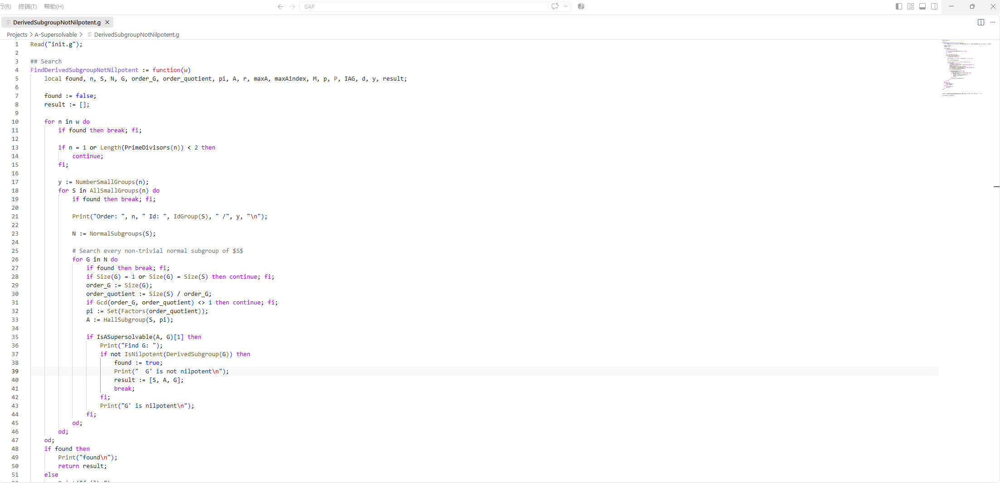
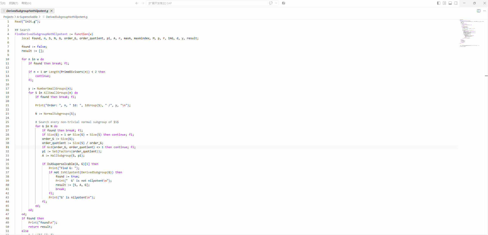
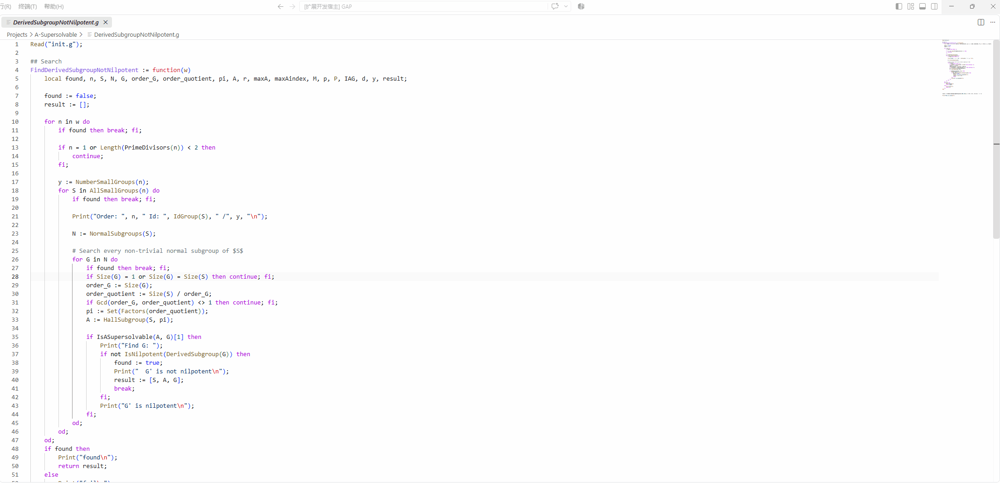

# GAP Help

[](LICENSE)
[](https://www.gap-system.org/)

[English](README.md) | 简体中文

在 VS Code 中搜索和阅读 GAP 帮助文档。

支持划词查询、QuickPick 实时搜索（行为与 GAP 中 `?help` 和 `??help` 一致），结果在 Webview 面板中展示，并支持页内链接跳转和 MathJax 数学公式渲染。

> GAP 是一个计算离散代数的系统，特别侧重于群论计算，在数学研究中有广泛应用。GAP 内置了非常完善的帮助文档，本扩展基于 GAP 原生帮助系统开发，希望帮助 GAP 用户更便捷地使用和学习 GAP。更多信息请见 [GAP 官方网站](https://www.gap-system.org/)。

## 前置条件

本扩展配合 Windows 版 GAP（.exe 安装程序）使用，且要求 GAP 已添加到系统 `PATH`。

**1. 添加 GAP 到 `PATH`**

以 GAP 4.16.0 为例，在 PowerShell 中执行（请将路径替换为实际安装路径）：

```powershell
$userPath = [Environment]::GetEnvironmentVariable('PATH', 'User')
[Environment]::SetEnvironmentVariable('PATH', $userPath + ';C:\Program Files\GAP-4.16.0\runtime\bin;C:\Program Files\GAP-4.16.0\runtime\opt\gap-4.16.0', 'User')
```

**2. 验证安装**

重启终端后运行以下命令，确认 `gap` 已正确添加：

```bash
gap --version
```

## 功能说明

- 扩展首次激活时自动生成帮助索引文件，后续可通过 `Ctrl+Shift+P` 输入 `GAP: Rebuild Help Index` 手动重建。

- 支持两种搜索模式，可在设置或 QuickPick 搜索框中随时切换：
  - **prefix**：对应 GAP 中的 `?help`
  - **substring**：对应 GAP 中的 `??help`

- 搜索结果在 Webview 面板中展示，支持页内链接跳转和 MathJax 数学公式渲染。

## 功能演示

以下演示了本扩展的主要功能：划词查询、QuickPick 搜索、书籍筛选、右键菜单打开 GAP Reference Manual 以及 Webview 面板内的链接跳转。

### 划词查询

在 GAP 代码中选中一词，右键选择 `Help in GAP` 即可查询。



### QuickPick 搜索

通过 `Ctrl+Shift+P` 输入 `GAP: Help in GAP`，或在编辑器中右键点击 `Help in GAP`，打开 QuickPick 搜索框，输入内容后点击结果查看。


### 书籍筛选

在 QuickPick 搜索框中点击筛选按钮，限定在指定书籍范围内搜索。



同样支持先搜索后筛选书籍。



### GAP Reference Manual 与页内跳转

右键菜单可直接打开 GAP Reference Manual，Webview 面板内点击链接可在页面间跳转。


## 开发

首先安装依赖并编译 TypeScript 源码：

```bash
npm install
npm run compile
```

之后按 `F5` 即可启动调试。

## 许可证
[MIT](LICENSE)